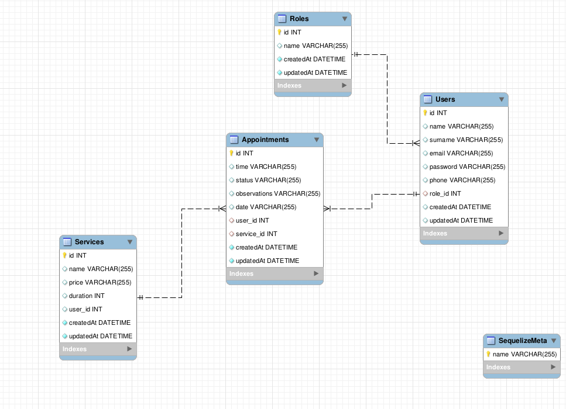

# Proyecto 4 - Sistema de Gestión de Citas para Clínica Dental
<details>
  <summary>Contenido 📝</summary>
  <ol>
    <li><a href="#objetivo">Objetivo</a></li>
    <li><a href="#sobre-el-proyecto">Sobre el proyecto</a></li>
    <li><a href="#diagrama-er">Diagrama Entidad Relación</a></li>
    <li><a href="#tecnologías-utilizadas">Stack - Tecnologías utilizadas</a></li>
    <li><a href="#instalación-en-local">Instalación en local</a></li>
    <li><a href="#endpoints">Endpoints</a></li>
    <li><a href="#contribuciones">Contribuciones</a></li>
    <li><a href="#contacto">Contacto</a></li>
  </ol>
</details>

## Objetivo
Este proyecto requería una API funcional conectada a una base de datos con al menos una relación de uno a muchos y una relación de muchos a muchos.

## Sobre el proyecto
Esta API ha sido desarrollada por **Jesús Vázquez Muñoz**, como cuarto proyecto del **Bootcamp de Full Stack Developer de Geekshubs Academy**, el cuál se basa en el diseño del backend de una aplicación. El cuál es totalmente funcional y se puede realizar consultas mediante POSTMAN.

## Diagrama ER


## Tecnologías utilizadas
- Express
- Node.js
- Javascript
- GitHub
- Git
- Docker
- Mysql
- Postman
- JWT

## Instalación en local
1. Clonar el repositorio
2. ` $ npm install `
3. Conectamos nuestro repositorio con la base de datos
4. Ejecutamos las migraciones
` $ sequelize db:migrate `
5. Ejecutamos los seeders
` $ sequelize db:seed:all `
6. Levantamos el servidor de express
` $ npm run dev `

## Endpoints

El proyecto actualmente se encuentra en desarrollo y los siguientes endpoints han sido implementados y probados con éxito:

- POST /auth/register: Registro de usuarios.
- POST /auth/login: Inicio de sesión de usuarios.
- GET /user/profile: Perfil de usuario.
- PUT /user/profile: Modificación de datos del perfil de usuario.
- POST /appointments: Creación de citas.
- PUT /appointments/:id: Modificación de una cita existente.
- DELETE /appointments/:id: Anulación de una cita existente.
- GET /appointments: Obtener todas las citas del usuario actual.
- GET /appointments/all: Obtener todas las citas existentes (solo para dentistas).
- GET /clients: Obtener todos los clientes registrados (solo para dentistas).
- Además, se han creado los modelos y sus relaciones de Role, User, Service y Appointment que son utilizados en el sistema.

## Contribuciones
Las sugerencias y aportaciones son siempre bienvenidas.  

Puedes hacerlo de dos maneras:

1. Abriendo una issue
2. Crea un fork del repositorio
    - Crea una nueva rama  
        ```
        $ git checkout -b feature/nombreUsuario-mejora
        ```
    - Haz un commit con tus cambios 
        ```
        $ git commit -m 'feat: mejora X cosa'
        ```
    - Haz push a la rama 
        ```
        $ git push origin feature/nombreUsuario-mejora
        ```
    - Abre una solicitud de Pull Request

## Agradecimientos
Agradezco a mis compañeros y profesores el tiempo dedicado a este proyecto.


